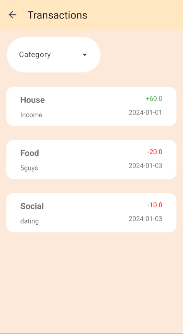

# Expense Tracker

Expense Tracker is a simple application designed for learning purposes.

## Screenshots

| Dashboard          | Transactions          | Add                |
|:--------------------:|:-----------------------:|:--------------------:|
|  | |  |

| Update             | Detail             | Reports            | 
|:--------------------:|:--------------------:|:--------------------:|
|  |  |  

## Built With

- [Kotlin](https://kotlinlang.org/) - Programming language used
- [Android Architecture Components](https://developer.android.com/topic/libraries/architecture) - For building a robust and maintainable architecture
- [Room Persistence Library](https://developer.android.com/topic/libraries/architecture/room) - For local data storage
- [Material Components for Android](https://github.com/material-components/material-components-android) - Modular and customizable Material Design UI components for Android.
- [Retrofit](https://square.github.io/retrofit/) - For networking
- [MPAndroidChart](https://github.com/PhilJay/MPAndroidChart) - For creating interactive charts

## Architecture

The project follows the MVVM (Model-View-ViewModel) architecture pattern. It separates the user interface from the business logic and backend data, making the codebase more modular, testable, and maintainable.

## License

This project is licensed under the MIT License - see the [LICENSE](LICENSE) file for details.

## License
This project is licensed under the [Apache License 2.0](https://choosealicense.com/licenses/apache-2.0/)

